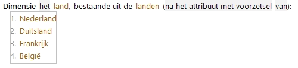
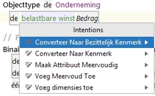

# Dimensies

Bij attributen waarvoor in verschillende situaties verschillende waarden gelden, kunnen dimensies worden gespecificeerd. Hiermee wordt voorkomen dat in het gegevensmodel heel veel aparte attributen moeten worden opgenomen.

## Voorbeeld: 

De belastbare winst moet worden verdeeld over verschillende landen. In het gegevensmodel wordt de dimensie "Land" gespecificeerd met waardenlijst van landen:

De dimensie wordt toegewezen aan een attribuut:

Door het toevoegen van de dimensie "land" aan het attribuut "belastbare winst" kunnen regels worden gemaakt met de combinatie van attribuut en dimensie:

