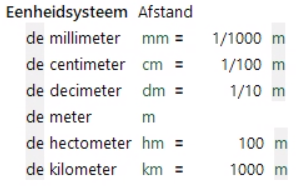
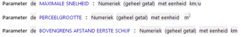

# Eenheidssystemen

Eenheidssystemen bevatten de specificatie van een set gerelateerde basiseenheden met hun omrekenfactor. Bijvoorbeeld afstand of hoeveelheid elektrische energie.

De basiseenheden moeten van klein naar groot in de lijst worden geplaatst met de bijbehorende omrekenfactor naar een andere basiseenheid. Een eenheid heeft een naam, een afgekorte notatie en een symbool.

Een eenheid uit een eenheidssysteem kan bij attributen en parameters worden toegevoegd aan de datatypes Numeriek en Percentage. Hierbij kunnen eenheidssystemen ook in combinatie gebruikt worden.

In regels worden de omrekenfactoren automatisch toegepast.
