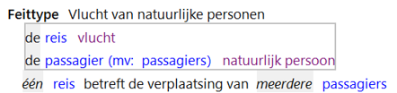

# Feittypen

Feittypen specificeren de relaties tussen objecttypen. 
Die relatie wordt gespecificeerd met behulp van rollen. 

Een vlucht heeft de rol "reis" in relatie tot een natuurlijk persoon. 
Een natuurlijk persoon heeft de rol "passagier" in relatie tot een vlucht. 
