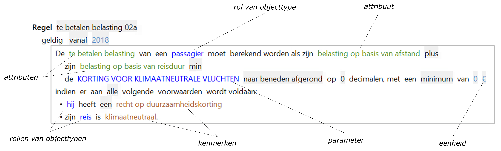

# Objectmodel
Het objectmodel is de basis voor het schrijven van regels in ALEF.

 

 Binnen het gegevensmodel kunnen in een objectmodel de volgende elementen worden gespecificeerd:
 
 * (Extensie van) [objecttypen](objecttype.md)
 * [Feittypen](feittype.md)
 * [Parameters](parameter.md)
 * [Eenheidssystemen](eenheidssysteem.md)
 * [Domeinen](domein.md)
 * [Dimensies](dimensies.md)
 * [Dagsoorten](dagsoort.md)
 