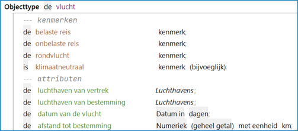
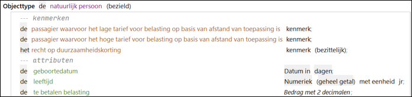
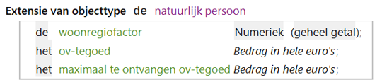

# Objecttype

Bij objecttypen worden gespecificeerd:

* Attributen met [datatype](datatype.md) (en eventueel eenheid en/of dimensies)
* Kenmerken

Een object heeft een kenmerk als het object aan bepaalde voorwaarden voldoet. Deze specificatie wordt vastgelegd in regels van het regeltype "Kenmerktoekenning".
Het gebruik van kenmerken draagt bij aan de leesbaarheid van regels en voorkomt het veelvuldig opnemen van dezelfde voorwaarden in regels.

 

Een objecttype kan bezield of onbezield zijn (is van invloed op de syntax van de regel).

 

## Extensies van objecttypen 
De volledige specificatie van een objecttype kan worden opgedeeld door extensies van objecttypen te gebruiken.

 

In een objectextensie kunnen de specificaties voor een bepaald functioneel deel worden opgenomen. Dit draagt bij aan de overzichtelijkheid van grote gegevensmodellen.

