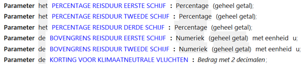
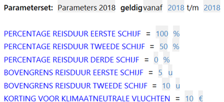

# Parameters

Parameters zijn normen en constanten die, onafhankelijk van de invoerwaarden van de attributen bij de objecten,
voor ieder geval gelden.

In het objectmodel worden parameters met hun datatype en eventueel eenheid gespecificeerd: 

In parametersets worden waarden aan parameters toegekend met een bepaalde geldigheid:

