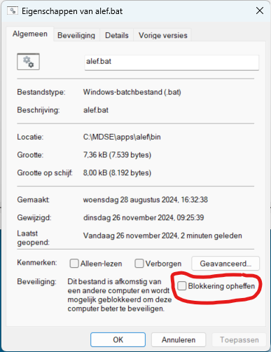
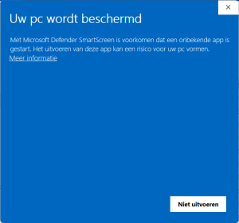

# Windows

Download de [ALEF distributie](https://github.com/belastingdienst/ALEF/releases) voor Windows ([laatste versie](https://github.com/belastingdienst/ALEF/releases/latest/download/alef-windows.zip)).

Maak op je bureaublad een nieuwe map met de naam apps
Unzip het gedownloade bestand in de map `C:\Users\[hier je accountnaam]\Desktop\apps\alef`

Ga naar `C:\Users\[hier je accountnaam]\Desktop\apps\alef\bin\` en klik met de rechtermuistoets op `alef.bat`. Selecteer "Meer opties weergeven" en vervolgens "Eigenschappen" en klik op "Blokkering opheffen"

Maak een snelkoppeling voor ALEF-Studio op het bureaublad naar `C:\Users\[hier je accountnaam]\Desktop\apps\alef\bin\alef.bat`
Toelichting : De ALEF-applicatie moet op de Windows werkplek worden geïnstalleerd.

**Let op**: Je kunt ALEF ook in een andere map zetten indien gewenst zolang deze map binnen `C:\users\[hier je accountnaam]` zit zoals in mijn documenten. Als je ALEF in een andere map op de `C:\` schijf zet krijg je een foutmelding dat de applicatie is geblokkeerd door de beheerder.
Standaard worden van "Internet" gedownloade bestanden door Windows geblokkeerd zodat je ze niet kunt uitvoeren. Als je deze blokkering niet opheft kun je ALEF niet starten. Je krijgt dan onderstaande melding:

Alle voor regel-analisten overbodige menu-items in ALEF zijn verborgen. Als je dit niet wilt dan kunnen de default settings worden teruggezet via de menu-optie "Settings".
Selecteer daarna "Appearance &  Behavior" - "Menus and Toolbars". Kies vervolgens  met de -knop voor "Restore All Defaults".

