# Quick start

Deze quick start handleiding helpt om een ALEF service te maken.

## Precondities

ALEF dient geinstalleerd te zijn. Zie de installatie instructie voor:

* [Windows](installeren/Windows.md)
* [macOS](installeren/macOS.md)
* [Linux](installeren/Linux.md)

## Nieuw project

Als ALEF de eerste keer wordt gestart verschijnt het "Welcome" scherm. Kies voor "New Project".
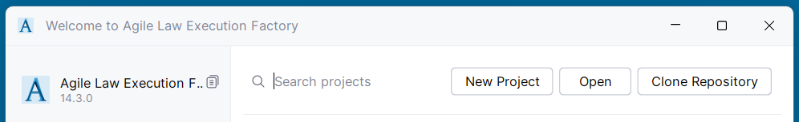
Als ALEF al een keer gestart is kies dan voor File > New > Project. 

> **_Windows:_**  In Windows is het File menu zichtbaar nadat op de het icon met vier horizontale balken wordt geklikt.
>
> 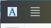

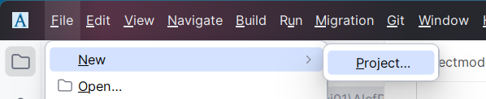
1. Kies voor **Solution project**.
2. Geef een **Project name** `quick-start-project` op.
3. Geef bij **Project location** de locatie op voor het project. Bijvoorbeeld `C:\Users\<uw_gebruikersnaam>\AlefProjects\quick-start-project`.
4. Geef bij **Solution name** `Hello World` op.
5. Kies **OK**.

Het nieuwe project is nu aangemaakt.
## Maak een model

1. Klik rechts op de solution `Hello World` en kies voor **New** > **Model**. 

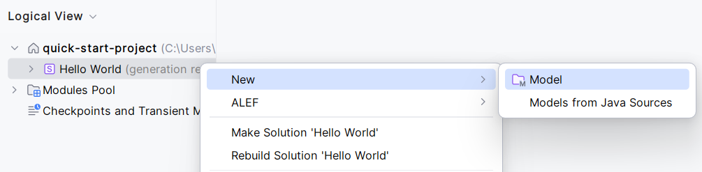
2. Het **New Model** scherm verschijnt. Vul bij **Model name** de naam `model` in en kies **OK**.  
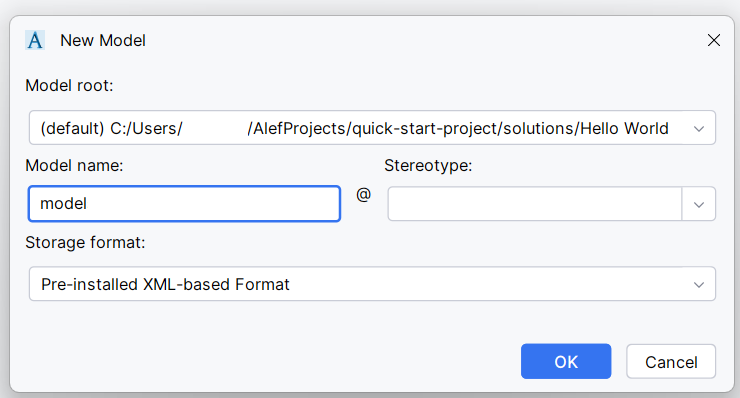
3. Het **Model properties** scherm verschijnt. Ga naar tabblad **Used Languages** en kies `+`.

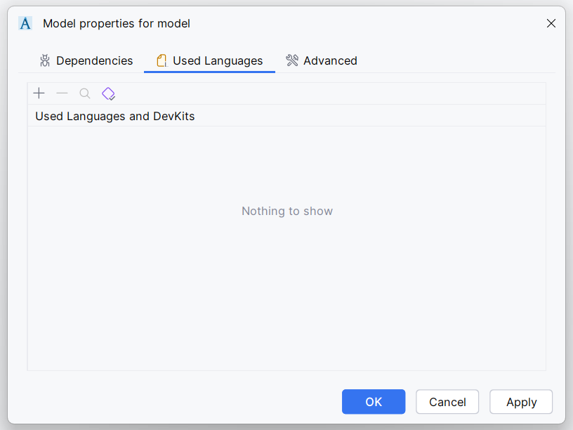 

4. Kies `alef.devkit` in de lijst die verschijnt en kies **OK**.

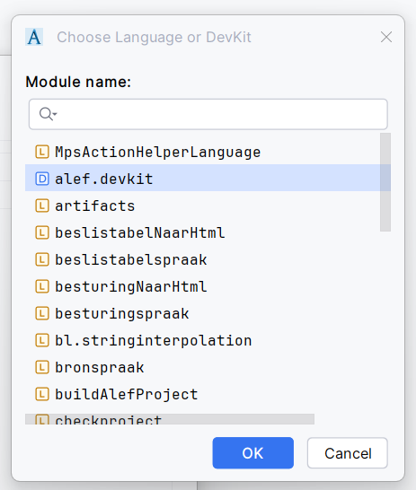

5. Kies vervolgens nogmaals **OK**.

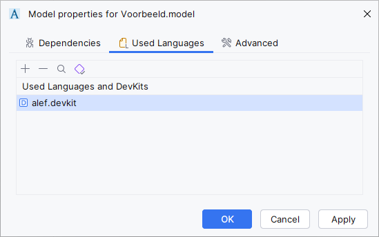

Het nieuwe model is nu aangemaakt. 
## Objectmodel

Het objectmodel beschrijft alle attributen en feiten. 

1. Klik rechts op het model en kies voor **New** > **gegevensspraak** > **Objectmodel**.
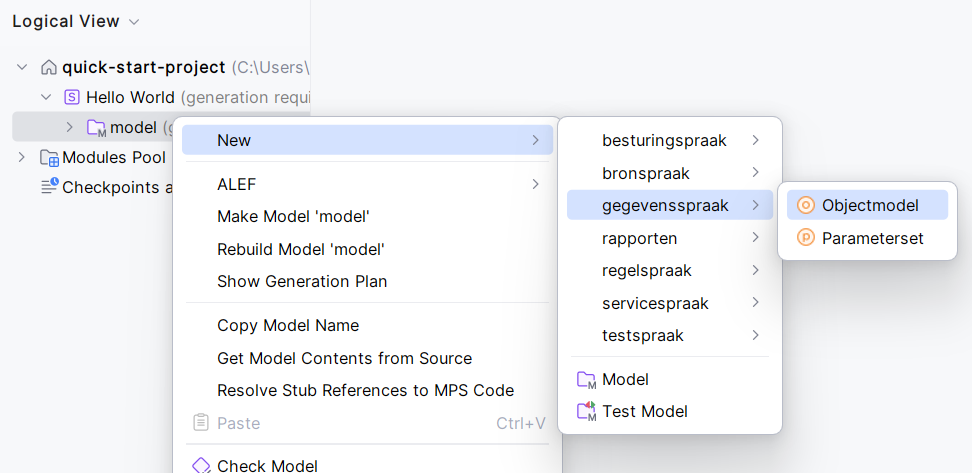
2. Geef het objectmodel de naam `objectmodel` en druk op Enter.
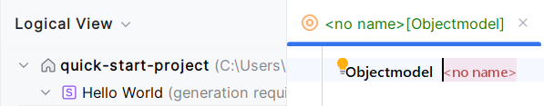
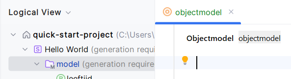
3. Druk ctrl + spatie en kies `Objecttype` om een nieuw objecttype toe te voegen.  
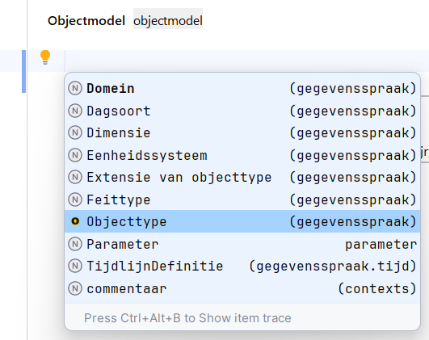
4. Geef het objecttype de naam `persoon` en druk op Enter.
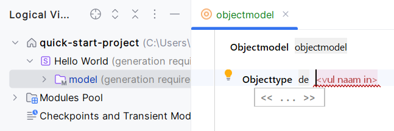
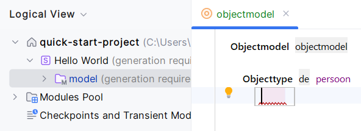
5. Druk ctrl + spatie en kies `Attribuut` om een nieuw attribuut aan het objecttype toe te voegen. 
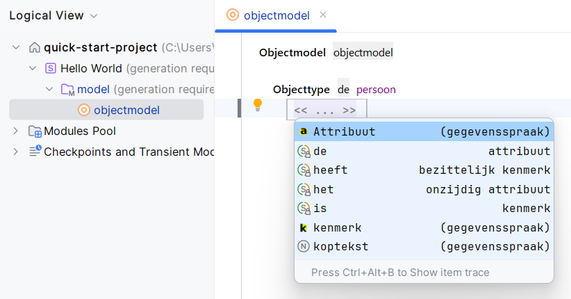
>Een attribuut is een eigenschap van het objecttype. Bijvoorbeeld: objecttype `persoon` heeft attribuut `geboortedatum` en `leeftijd`. 
6. Noem het attribuut `geboortedatum`. 
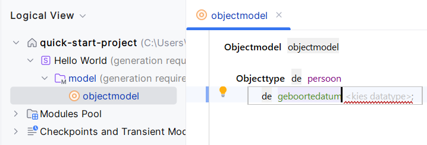
7. Druk op tab en vervolgens ctrl + spatie om een datatype voor het attribuut te kiezen. Kies `Datum-tijd`.
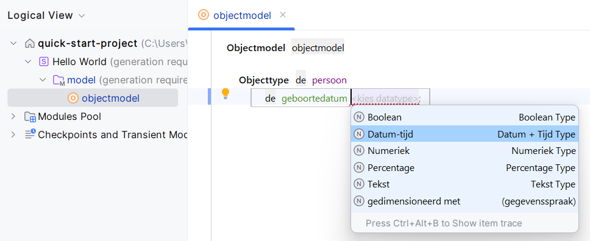
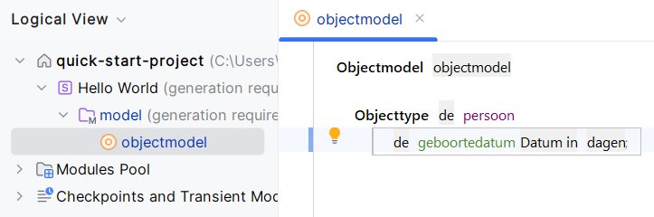
8. Druk op Enter en voeg op dezelfde manier als hiervoor een attribuut met de naam `datum van vandaag` toe. Kies bij datatype voor Datum-tijd.
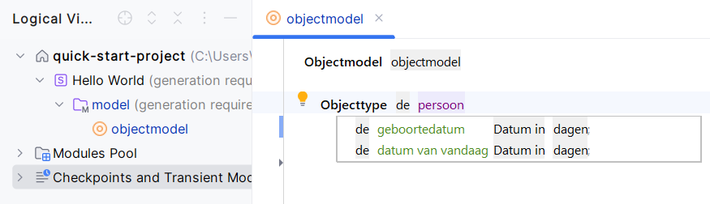
9. Druk op Enter en voeg op dezelfde manier als hiervoor een attribuut met de naam `leeftijd` toe, maar kies bij het datatype voor Numeriek.
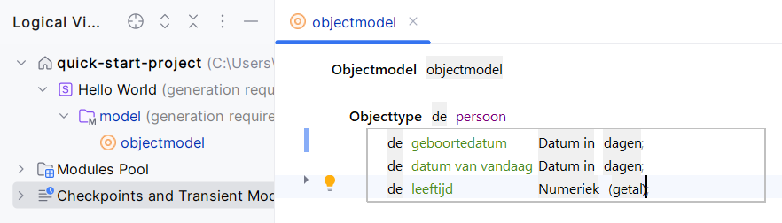
10. Plaats bij het attribuut `leeftijd` de cursor tussen `)` en `;`, druk vervolgens spatie en daarna ctrl + spatie. Kies `met eenheid` om een eenheid toe te voegen aan het datatype. 
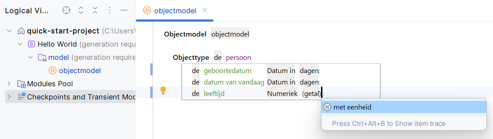
>TIP: als de optie `met eenheid` niet verschijnt stond de cursor niet op de juiste plek. Plaats de cursor tussen het haakje sluiten `)` en puntcomma `;` en probeer het opnieuw.
11. Druk ctrl + spatie en kies `jr` om de eenheid jaar toe te voegen aan het datatype Numeriek (getal).
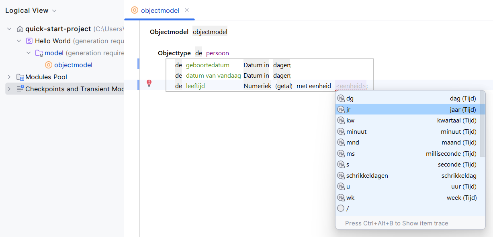

Het objectmodel is nu klaar om er een regelgroep bij te maken. 

## Regelgroep

Regelgroepen bevatten de logica van het project.

1. Klik rechts op het model en kies voor **New** > **regelspraak** > **Regelgroep**.

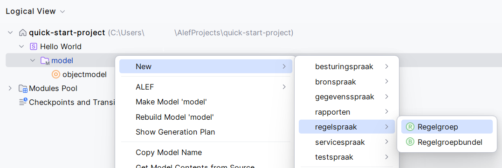
2. Geef de regelgroep de naam `leeftijd` en druk op Enter.

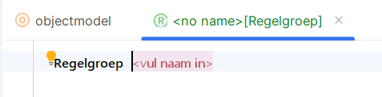

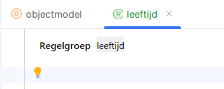

3. Druk ctrl + spatie en kies `regel` om een nieuwe regel aan de regelgroep toe te voegen.

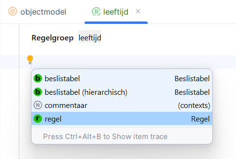

4. Geef de regel de naam `Bepalen leeftijd` en druk op tab.
<!-- TODO: opmaak toetsen(combinaties uniformeren !-->
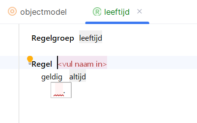

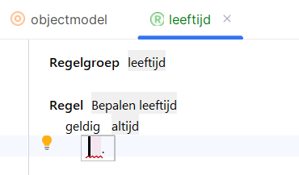

>Deze regel berekent iemands leeftijd op basis van diens geboortedatum. Voor berekeningen gebruikt RegelSpraak de Gelijkstelling. 
5. Druk ctrl + spatie en kies `Gelijkstelling`.

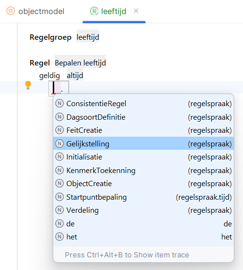

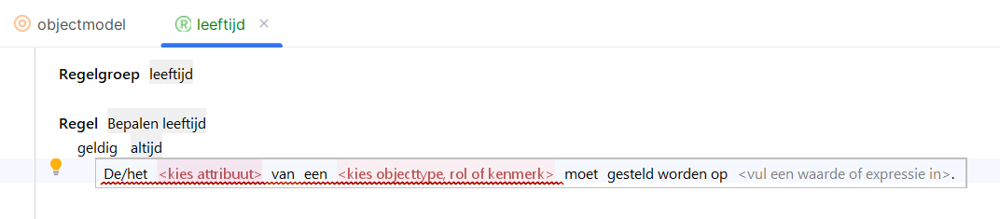 

6. Druk ctrl + spatie en kies `leeftijd`.

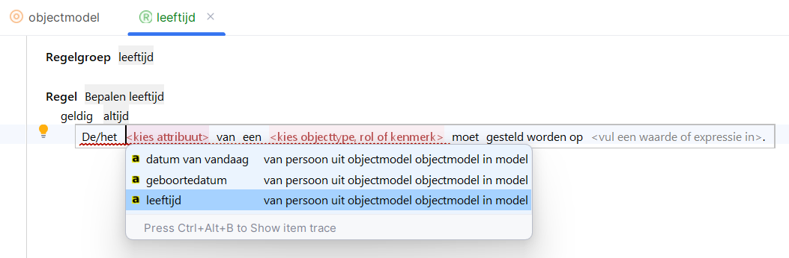

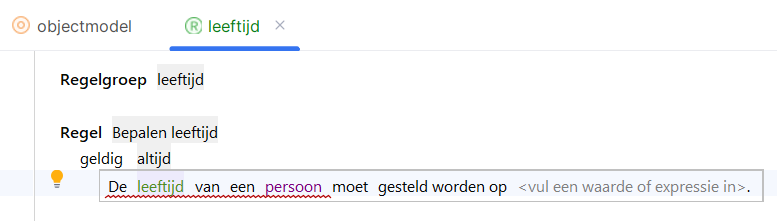

7. Klik op `vul een waarde of expressie in` of druk meermaals op tab totdat de cursor voor `<` staat.

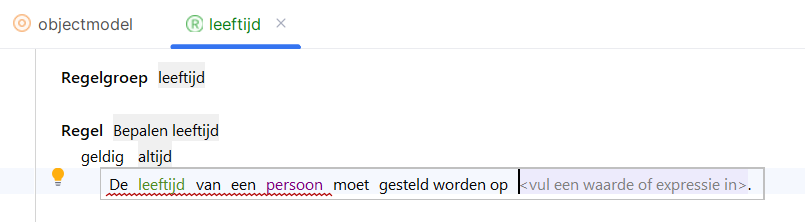

8. Druk ctrl + spatie, typ `tijd` en kies `de tijdsduur van datum(tijd) tot datum(tijd)` uit de lijst.

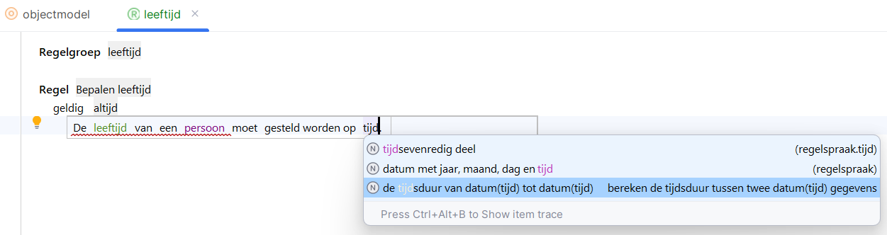

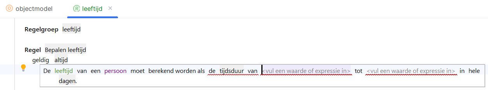

>Een leeftijd bereken je vanaf iemands geboortedatum. Ons objectmodel bevat al het attribuut `geboortedatum`.  

9. Druk ctrl + spatie en kies `attribuut`. 

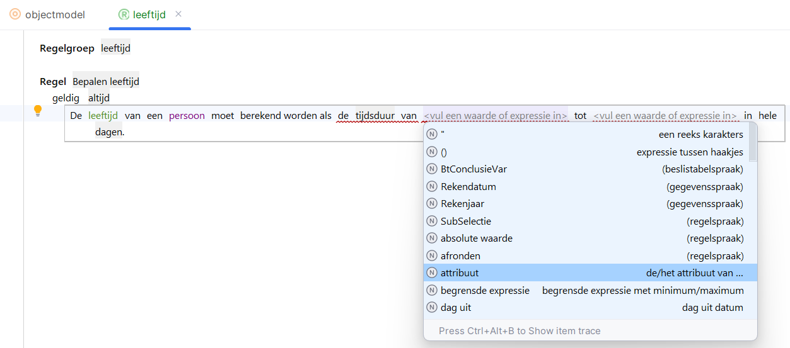

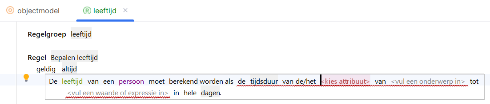

10. Druk ctrl + spatie en kies attribuut `geboortedatum`.

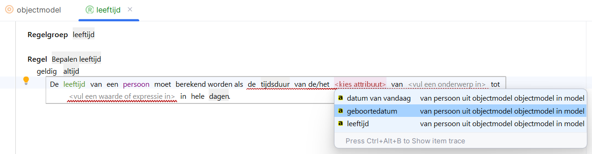

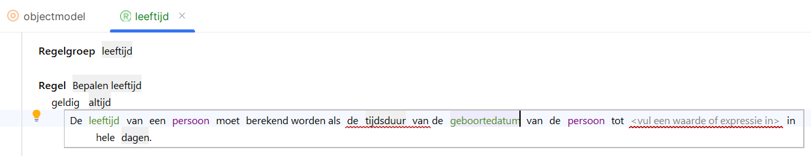

11. Klik op `vul een waarde of expressie in` of druk meermaals op tab totdat de cursor voor `<` staat.

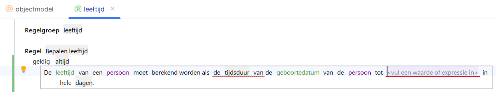

12. Druk ctrl + spatie en kies `attribuut`. 

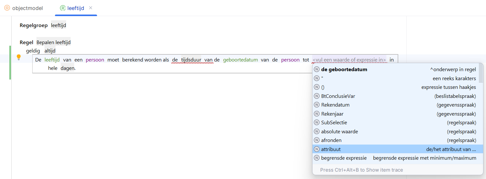

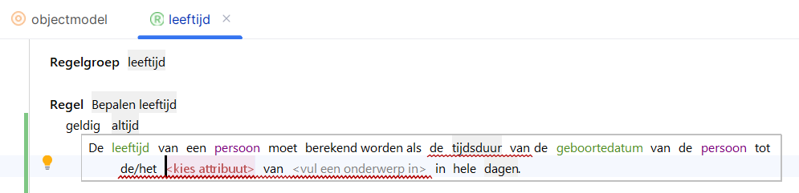

13. Druk ctrl + spatie en kies attribuut `datum van vandaag`.

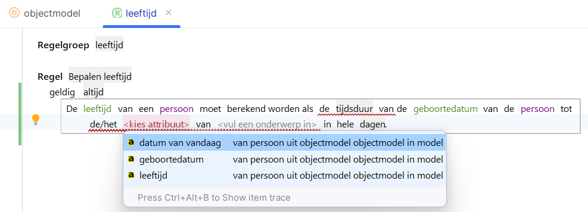

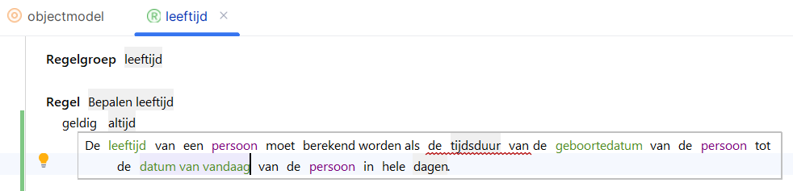

>Onder `de tijdsduur van` zie je een rode kronkellijn (error). De mouse-over maakt duidelijk waarom dit is: de regel berekent `leeftijd` in hele dagen (dg), maar in ons objectmodel heeft `leeftijd` de eenheid jaren (jr). Een leeftijd wordt immers meestal in jaren berekend. We moeten daarom de regel die we net gemaakt hebben aanpassen, zodat hij de leeftijd in hele jaren berekent. 

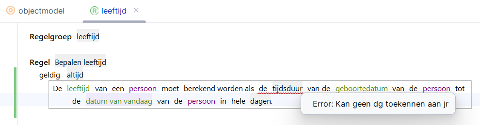

14. Zet de cursor vóór het woord `dagen`, druk op ctrl + spatie en kies `jaren`. De rode kringellijn (error) zal nu verdwijnen, omdat de eenheid nu klopt. 

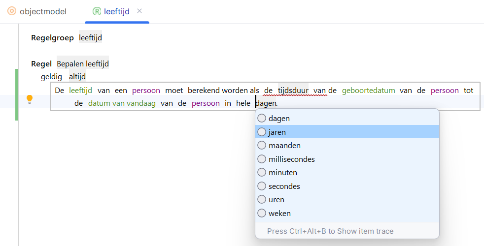

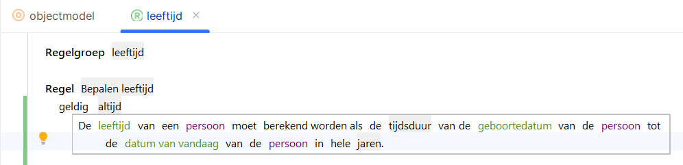

De regel is nu compleet en kloppend. We kunnen nu testgevallen bij de regel maken om te testen of de regel doet wat we zouden verwachten. 

## Testset

1. Klik rechts op het model en kies voor **New** > **testspraak** > **Testset**.

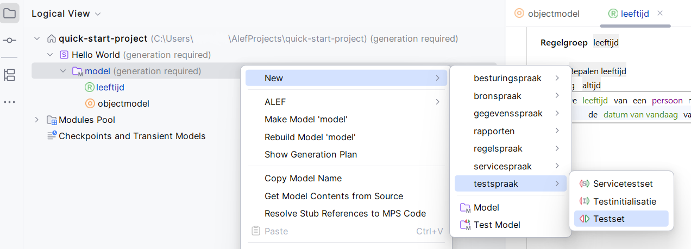

2. Geef de test de naam `Leeftijd bepalen` en druk op tab.

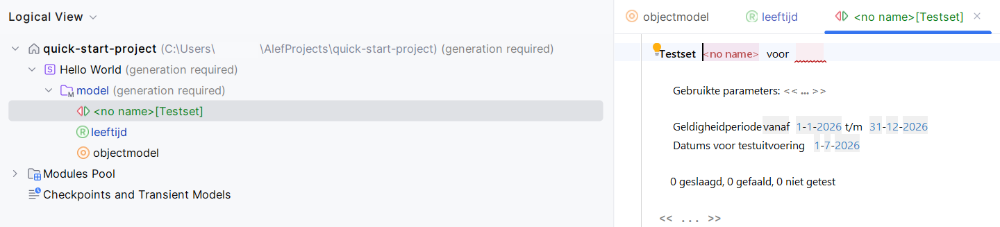

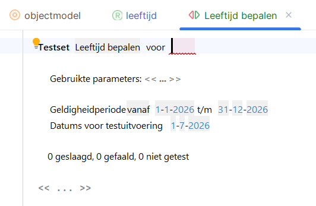

3. Druk op ctrl + spatie en kies `regel`. 

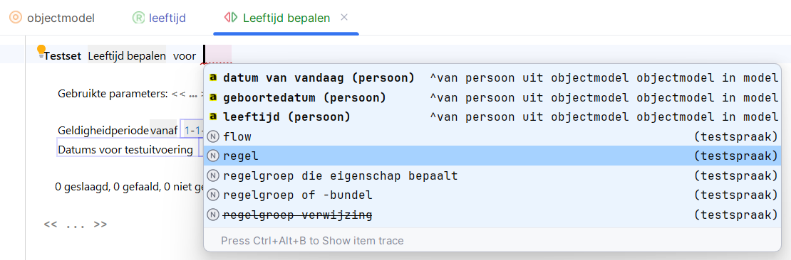

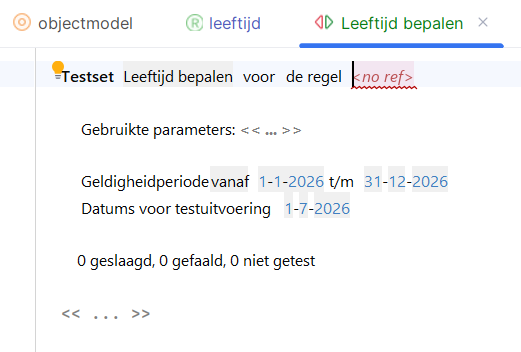

4. Druk op ctrl + spatie en kies de regel `Bepalen leeftijd`.

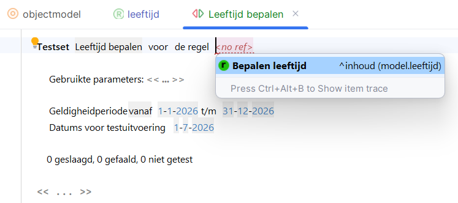

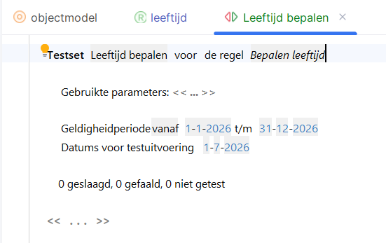

5. Klik op de onderste `<< ... >>` of druk meermaals op tab tot de cursor vóór de onderste `<<` staat.

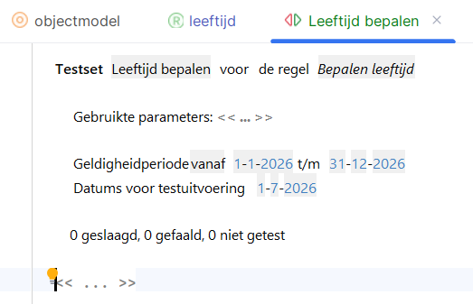

6. Druk ctrl + spatie en kies `TestGeval`. 

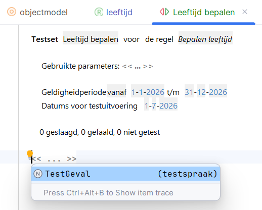

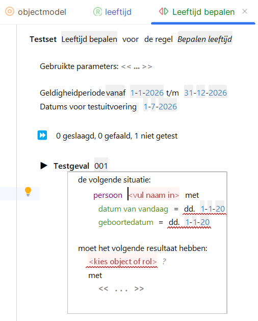

>Het eerste deel van het testgeval (paragraaf `de volgende situatie:`) noemen we het voorwaardendeel van het testgeval. 

7. Vul bij `persoon` een naam in, bijvoorbeeld Stef. 

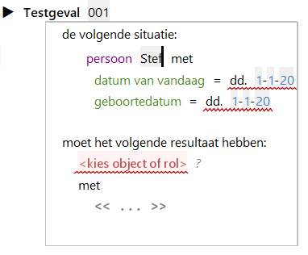

8. Druk twee keer op tab en vul bij `datum van vandaag` de waarde `21`-`4`-`2026` in.

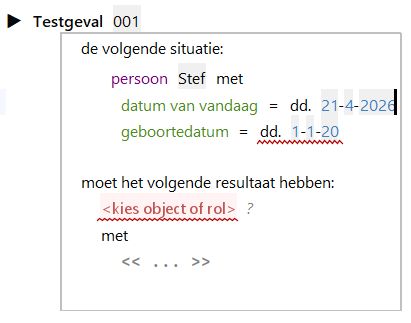

>De overbodige nullen in datums van testgevallen laat je weg (zoals de nul bij april hiervoor).

9. Druk twee keer op tab en vul bij `geboortedatum` de waarde `11`-`5`-`1990` in.

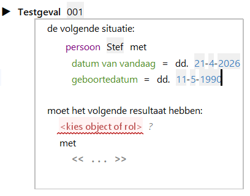

>Het tweede deel van het testgeval (paragraaf `moet het volgende resultaat hebben:`) noemen we het resultaatdeel van het testgeval. 

10. Druk tab, vervolgens ctrl + spatie, en kies `persoon`.

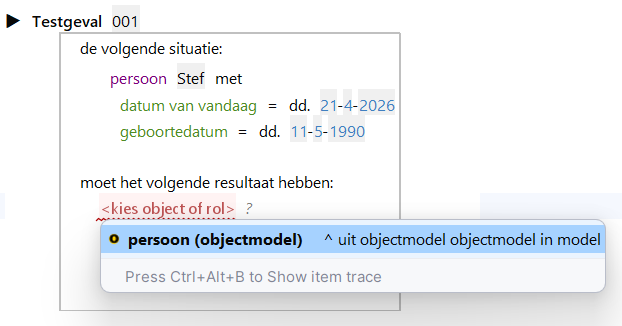

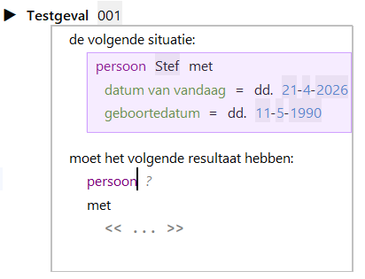

11. Druk tab, vervolgens ctrl + spatie, en kies `Stef`. 

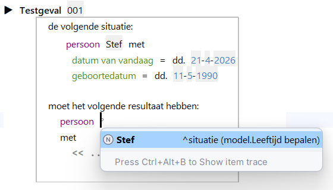

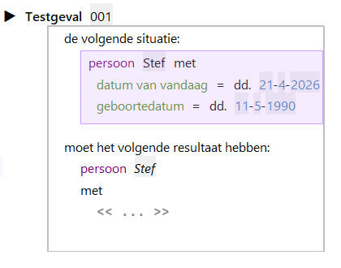

12. Druk twee keer op tab, vervolgens ctrl + spatie, en kies `leeftijd`. 

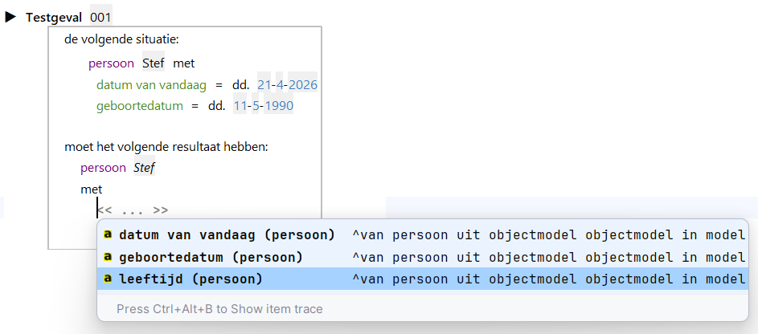

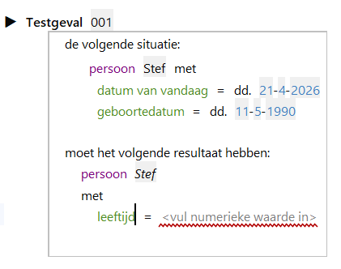

13. Druk tab en vul `35` in. 

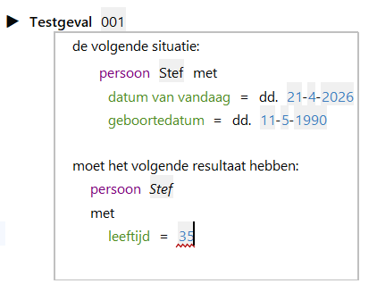

14. Druk alt + enter of klik op de lampenbol links van `leeftijd` en kies `Voeg Eenheid Toe Aan Numerieke Waarde`.

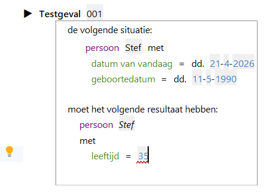

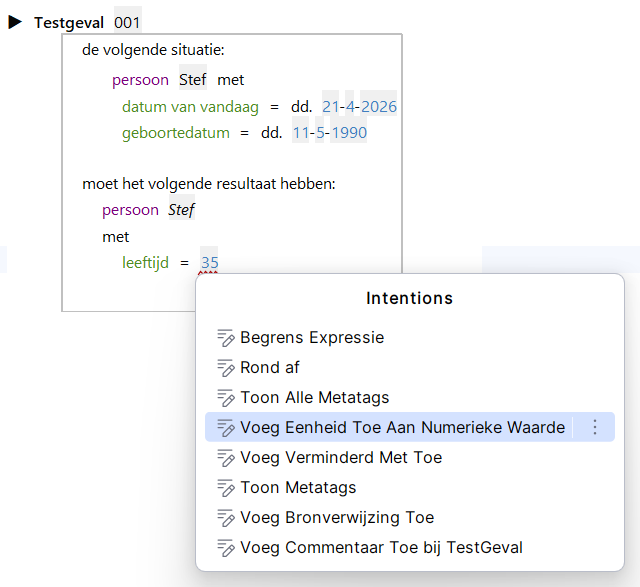

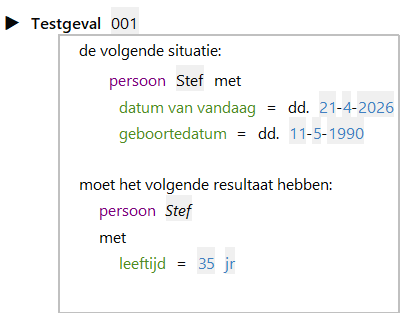

Het testgeval is nu gereed. 

## Testen

1. Klik op het execute-icoontje (driehoekje links van `Testgeval`) om een testgeval uit te voeren. Als op de plaats van het execute-icoontje een groen vinkje verschijnt is de test geslaagd.

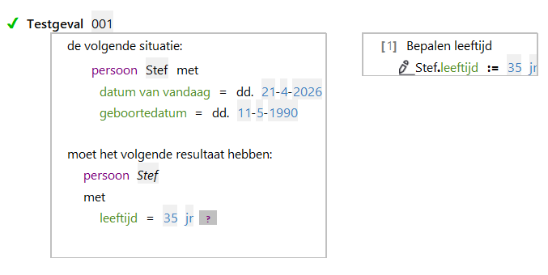

2. Als je wil zien waarom ALEF in dit testgeval 35 jaar als correct beschouwt kun je op het vraagteken achter `35 jr` klikken. Je krijgt dan de regel te zien die het testgeval heeft uitgevoerd, en de waarden die daarbij gebruikt zijn om tot de conclusie te komen. Tussen blokhaken staan de concrete waarden uit het testgeval. Deze waarden zie je ook rechts in de rechthoek, waar het oog-icoontje betekent dat die waarden zijn gelezen, en het potlood-icoontje dat die waarde geschreven is door de regel. 

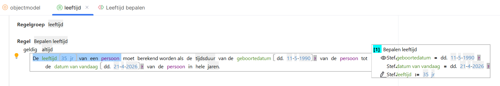

Je hebt in dit korte voorbeeld de drie basisingrediënten van elk ALEF-project gezien en gemaakt:

* het objectmodel
* de RegelSpraak regels
* de testsets

Veel plezier met ALEF en RegelSpraak!