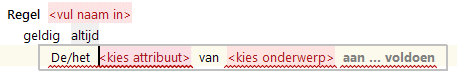
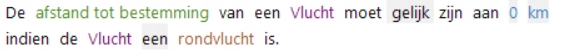
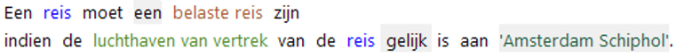
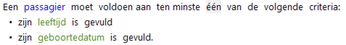

# Consistentieregel

De ConsistentieRegel is de actie voor het specificeren van een regel om te controleren of gegevens een juiste/geldige waarde hebben.

Consistentiecontroles worden uitgevoerd op invoerwaarden en worden gebruikt voor acceptatieservices.

Opties voor het opgeven van criteria waarop gecontroleerd moet worden:
* attribuut moet aan criterium voldoen.
* rol of expressie moet aan criterium voldoen.

## variant: attribuut moet aan criterium voldoen
Het resultaatdeel van de regel met een consistentiecontrole voor een attribuut ziet er als volgt uit:

Ook bij deze actie geldt dat een voorwaardendeel kan worden opgenomen waarin wordt bepaald 
wanneer de actie (consistentiecontrole) moet worden uitgevoerd.

## variant: rol of expressie moet aan criterium voldoen

Actie waarmee diverse soorten consistentiecontroles op objecten en rollen kunnen worden geformuleerd. 

Bijvoorbeeld:

een controle of voorkomens met een bepaalde rol of kenmerk aan een enkelvoudig criterium voldoen.

of

een controle van voorkomens met een bepaalde rol of kenmerk aan een meerdere criteria voldoen.

