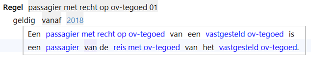
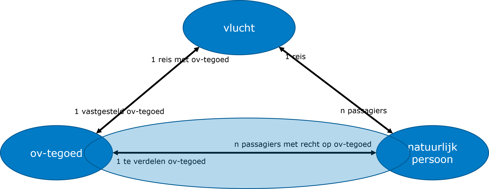
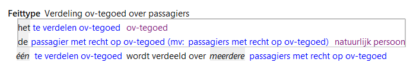

# Feitcreatie

Actie waarmee afgeleide relaties worden bepaald.

Deze regel legt een relatie tussen een ov-tegoed en een natuurlijk persoon en gebruikt daarin de rollen uit het feittype 'Verdeling ov-tegoed over passagiers'.

