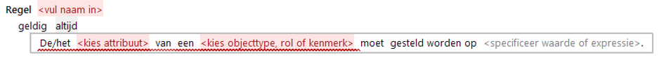

# Gelijkstelling

De Gelijkstelling is een actie waarbij voor een attribuut van een bepaald object een waarde wordt afgeleid.

Achter "specificeer waarde of expressie" kan worden gekozen uit een groot aantal expressies waarmee de gewenste formulering van de regel verder kan worden opgebouwd.
