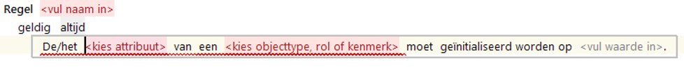

# Initialisatie

De Initialisatie is een specifieke variant van de actie [Gelijkstelling](../regels/Actie_Gelijkstelling.md).

Naast het kleine syntactische verschil geldt het volgende voor Initialisatie-regels: Deze regels leiden alleen tot een toekenning van een waarde aan een attribuut als dat attribuut nog geen waarde heeft (leeg is). Er is dus sprake van een impliciete voorwaarde.

**N.B. Deze regels worden/werden met name gebruikt voor het toekennen van waarden aan lege invoer-attributen. Door verdere ontwikkeling van ServiceSpraak zijn deze regels hiervoor niet meer nodig. In de specificatie van een invoerbericht kan een "verstekwaarde" worden opgegeven die wordt overgenomen als een attribuut leeg is.**
