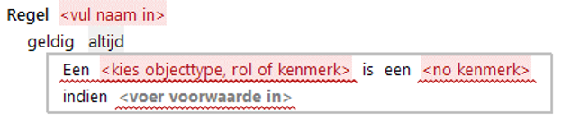
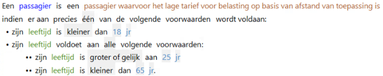
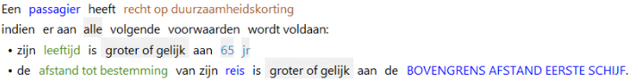
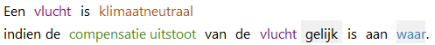
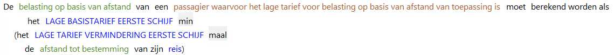
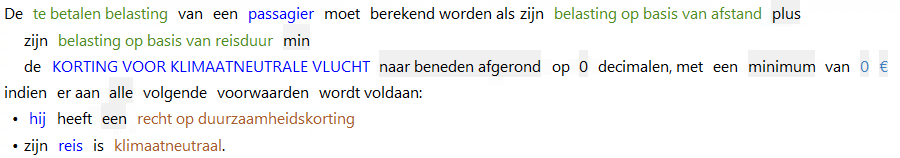

# Kenmerktoekenning
De Kenmerktoekenning is de actie voor het toekennen van een kenmerk aan een object of rol. 

Een object/rol krijgt een bepaald kenmerk als het object/de rol aan de in de regel gespecificeerde 
voorwaarde(n) voldoet. 

Toekenning van kenmerken kan ook genest worden (toekennen van een kenmerk aan een ander kenmerk).

Voordeel van het gebruik van kenmerken is dat de leesbaarheid van regels verbetert:
    * Door het gebruik van kenmerken is in een regel direct duidelijk op welk geval de regel betrekking heeft.   
    Bijvoorbeeld het gebruik van het kenmerk "belaste reis" in het onderwerp laat direct zien dat de regel alleen betrekking heeft op de situatie waarbij over de reis belasting moet worden betaald.
    * De voorwaarden die gelden voor de toekenning van het kenmerk hoeven niet meer in alle regels waarin ze gelden te worden herhaald. Door gebruik van het kenmerk gelden impliciet de daarbij behorende voorwaarden.   
    Voorbeeld: in alle regels waar het kenmerk "belaste reis" wordt gebruikt zijn de condities "bereikbaar per trein is gelijk aan waar" en "afstand tot bestemming van de reis is groter dan 0 km" van toepassing.

Een veel gebruikte toepassing is het in de service afbeelden van een invoerattribuut met het datatype boolean op een kenmerk. Regels waarin in de voorwaarden op de waarde "waar" of "onwaar" wordt uitgevraagd, lezen in het algemeen minder natuurlijk dan wanneer daar een kenmerk voor in de plaats wordt gebruikt.

## Drie vormen
Syntactisch kent de kenmerktoekenning 3 vormen:

1. Kenmerk: <objecttype, rol of kenmerk> is een <kenmerk>  

2. Bezittelijk kenmerk: <objecttype, rol of kenmerk> heeft <kenmerk>  

3. Bijvoeglijk kenmerk: <objecttype, rol of kenmerk> is <kenmerk>  

## Gebruik in onderwerp actiedeel

Algemene kenmerken kunnen in regels gebruikt worden in het onderwerp.

Bezittelijke en bijvoeglijke kenmerken kunnen niet in het onderwerp van een regel gebruikt worden, 
maar wel op andere plaatsen binnen een regel.

