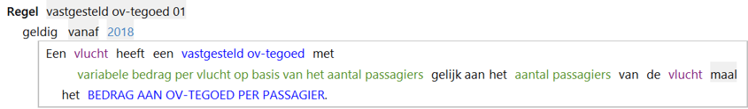
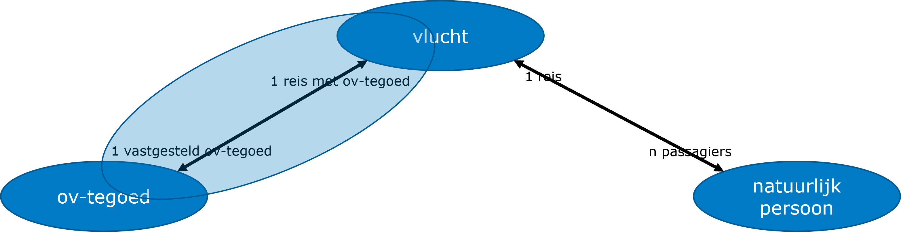
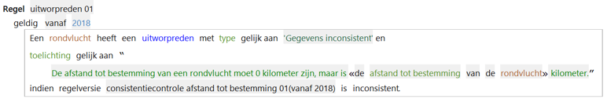
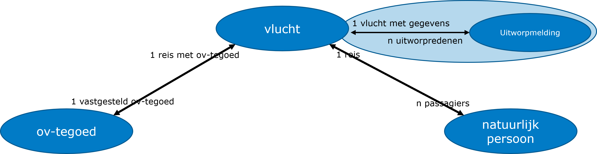

# Objectcreatie

Actie waarmee een voorkomen van een object wordt gecreëerd.

Tijdens creatie kan aan attributen een waarde worden toegekend.

Deze regel maakt een nieuw voorkomen van objectttype ov-tegoed en koppelt dit met de rol 'vastgesteld ov-tegoed' aan een voorkomen van de vlucht.

## Objectcreatie van een uitworpmelding

Voorbeeld van het creéren van een voorkomen van een objecttype 'uitworpmelding' waarbij aan een tekst-attribuut met een [tekst-expressie](../regels/Expressies.md) een waarde wordt toegekend.

Deze regel maakt een nieuw voorkomen van objecttype uitworpmelding en koppelt dit met de rol 'uitworpmelding' aan een voorkomen van de vlucht, dat het kenmerk 'rondvlucht' heeft.

