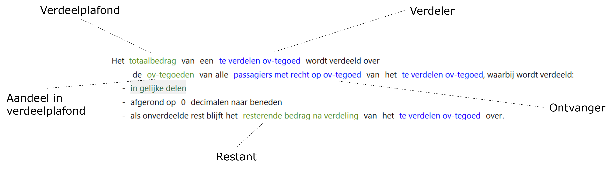
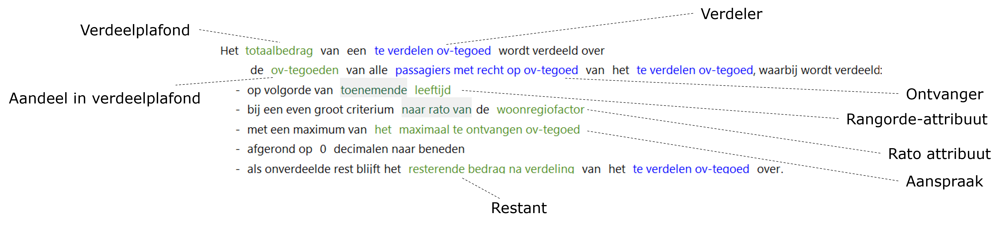

# Verdeling

Doel van deze actie is het verdelen van een te verdelen hoeveelheid (Verdeelplafond) die beschikbaar is bij een Verdeler naar te ontvangen hoeveelheden (aandeel in verdeelplafond) bij de Ontvangers.

Als niet het hele verdeelplafond wordt toegerekend aan ontvangers (door afronding van het aandeel in verdeelplafond) dan wordt een restant berekend dat bij de Verdeler blijft.

Opties binnen de toepassing van de actie:

* Verdelen in **gelijke delen** of **naar rato** van een attribuut.
* Verdelen op basis van **groepen** of zonder groepen.  
Dit houdt in dat voorkomens van objecten in groepen worden ingedeeld op basis van de waarden van 1 of meer attributen.
* De te ontvangen hoeveelheid kan worden beperkt door een **aanspraak**.
De aanspraak bevat de maximale hoeveelheid die een ontvanger toegewezen kan krijgen. Het is alleen mogelijk om een aanspraak op te nemen voor de situatie waarin verdeeld wordt naar rato.

## Voorbeeld 1 - Verdeling zonder groepen

In dit geval wordt de hoeveelheid die door de Verdeler verdeeld wordt (verdeelplafond) in gelijke delen toegewezen aan de Ontvangers (aandeel in verdeelplafond). 

## Voorbeeld 2 - Verdeling met groepen

In dit geval wordt de hoeveelheid die door de Verdeler verdeeld wordt (verdeelplafond) toegewezen aan de Ontvangers (aandeel in verdeelplafond) op basis van een volgorde die wordt bepaald door een rangorde-attribuut (waarmee de groep wordt gevormd) met een toenemende volgorde.

De aanspraak die een Ontvanger kan hebben wordt bepaald door het aanspraak-attribuut en bepaalt het maximale aandeel in het verdeelplafond voor de Ontvanger. Tenslotte wordt door een rato-attribuut bepaald wat de verdeling moet zijn bij een gelijk criterium.

