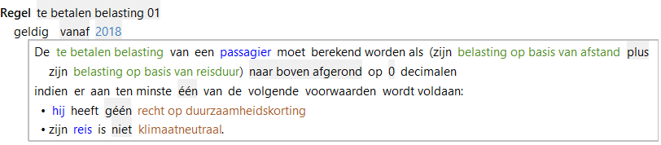

# Acties

Dit zijn uitdrukkingen waarmee de actie in het resultaatdeel wordt geformuleerd.

In onderstaande regel is de actie 'moet berekend worden als' (Gelijkstelling). In het actiedeel staat een numerieke [expressie](../regels/Expressies.md) 'belasting op basis van afstand plus belasting op basis van reisduur'.

In het resultaatdeel van een RegelSpraak regel kunnen de volgende acties worden gebruikt:

* [ConsistentieRegel](../regels/Actie_Consistentieregel.md)   
De ConsistentieRegel is de actie voor het specificeren van een regel om te controleren of gegevens een juiste/geldige waarde hebben.
* [Dagsoortdefinitie](../regels/Actie_Dagsoortdefinitie.md)   
De Dagsoortdefinitie is de actie waarmee een specifieke dagsoort wordt gedefinieerd.
* [Feitcreatie](../regels/Actie_Feitcreatie.md)   
Feitcreatie is de actie waarmee afgeleide relaties worden bepaald.
* [Gelijkstelling](../regels/Actie_Gelijkstelling.md)   
De Gelijkstelling is een actie waarbij voor een attribuut van een bepaald object een waarde wordt afgeleid.
* [Initialisatie](../regels/Actie_Initialisatie.md)   
De Initialisatie is een specifieke variant van de actie [Gelijkstelling](../regels/Actie_Gelijkstelling.md).
* [Kenmerktoekenning](../regels/Actie_Kenmerktoekenning.md)   
De Kenmerktoekenning is de actie voor het toekennen van een kenmerk aan een object of rol. 
* [Objectcreatie](../regels/Actie_Objectcreatie.md)   
De objectcreatie is de actie waarmee een voorkomen van een object wordt gecreéerd.
* [Verdeling](../regels/Actie_Verdeling.md)   
Verdeling is de actie voor het verdelen van een te verdelen hoeveelheid over een aantal Ontvangers.

