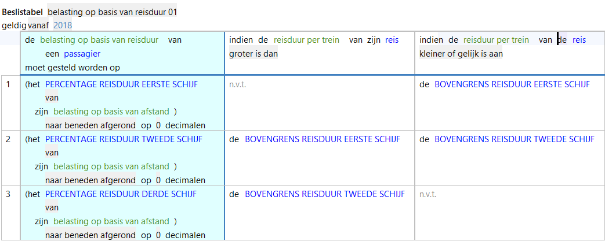

# Beslistabel

De Beslistabel is een presentatievorm om gelijkstellingen op te nemen in het regelmodel. 

De beslistabel bevat:
1 of meer **Conclusiekolommen**, waarin de toe te kennen waarden staan,
1 of meer **Conditiekolommen**, waarin de voorwaarden staan waaraan voldaan moet worden en
**Rijen**, die overeenkomen met een gelijkstellingsregel (equivalente regels worden getoond in de Inspector).

