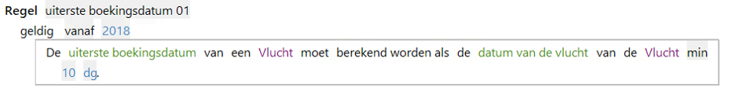
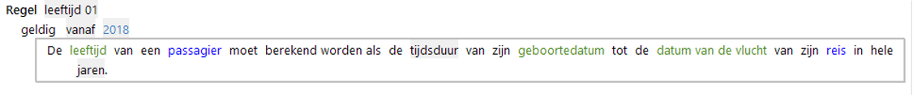

# Datum-tijd expressies

Expressies om te rekenen met tijd. Mogelijkheden:

* Datum = datum plus/min tijdsduur
* Tijdsduur = van datum tot datum
* Numerieke waarde uit deel van datum-tijd afleiden

## Datum bepalen
Een datum bepalen uit een datum plus of min een tijdsduur.  

## Tijdsduur berekenen
De tijdsduur tussen twee datums of tijdstippen berekenen. De tijdsduur is een numerieke waarde met een [granulariteit](#granulariteit).

## Numerieke waarde uit deel van datum-tijd afleiden
Uit een gegeven met waarde in datatype Datum-tijd kan een numeriek waarde worden bepaald. Hiervoor zijn de volgende expressies beschikbaar:

* jaar uit
* maand uit
* dag uit
* uur uit
* minuut uit
* seconde uit
* milliseconde uit  

## Granulariteit
Beschikbare granulariteiten voor datum-tijd zijn dag en milliseconde.

Beschikbare granulariteiten van eenheid Tijd lopen van milliseconde tot en met jaar.
N.B. De granulariteit van het resultaat van de afleiding moet consistent zijn met het attribuut waarin de tijdsduur wordt vastgelegd.

