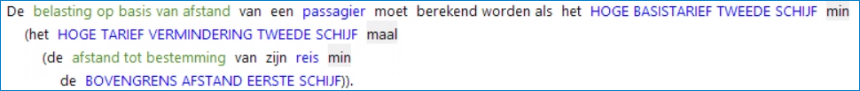
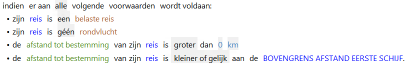
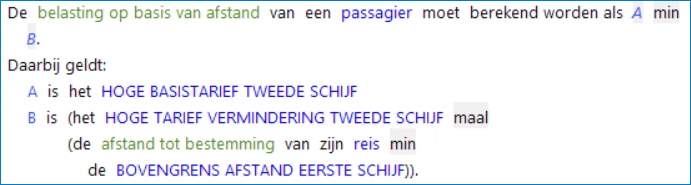

# De opbouw van een RegelSpraak regel
## Naam van een regel
Naamgevingsconventie: de naam van de regel is gelijk aan de naam van het gegevenselement (attribuut of kenmerk) dat een waarde krijgt in de regel, aangevuld met een volgnummer (naam moet uniek zijn).

## Geldigheidsperiode van een regelversie
De geldigheidsperiode bepaalt of een regelversie moet worden meegenomen bij de uitvoering van de regels voor een bepaald moment.

Geldigheidsperiodes van regelversies mogen niet overlappen.

De granulariteit van de geldigheidsperiode is in te stellen op dag of jaar.

## Inhoud van een regelversie

* Resultaatdeel (altijd aanwezig)
* Voorwaardendeel (optioneel)
* Variabelendeel (optioneel)

### Resultaatdeel van regelversie
Iedere regel bevat een resultaatdeel met een [actie](Acties.md).
Dit is het deel van de regel dat het resultaat van de regel beschrijft. 

In het resultaatdeel kan een aantal [acties](../regels/Acties.md) worden gebruikt.

### Voorwaardendeel van regelversie
Regels kunnen een voorwaardendeel bevatten. 

Dit is het deel van de regel waarin de voorwaarden staan waaraan moet worden voldaan om de actie in het resultaatdeel uit te voeren. 
Dit [**voorwaardendeel**](Voorwaardendeel.md) volgt na de 'indien'. Bijvoorbeeld:

**N.B. Als niet aan de voorwaarden wordt voldaan, dan levert de regel geen resultaat op.**

### Variabelendeel van regelversie

Binnen een regel kunnen variabelen worden gedefinieerd die alleen binnen die regel gebruikt worden.

Deze [variabelen](Variabelendeel.md) worden opgenomen in een tekstblok onder de regel dat begint met "Daarbij geldt:".

