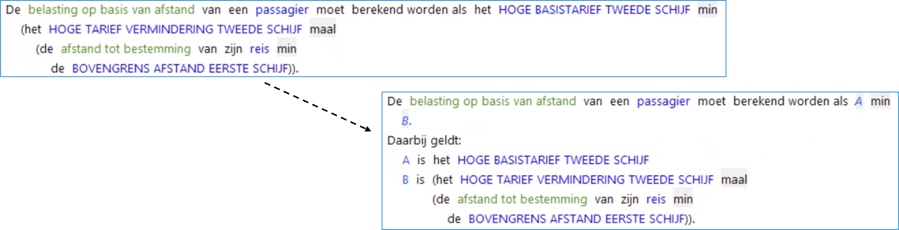

## Variabelendeel regel

Doel van het gebruik van variabelen is het vergroten van de leesbaarheid van de regel.
Variabelen worden standaard aangeduid met hoofdletters ("A", "B", etc.).   
Deze variabelen worden opgenomen in een tekstblok onder de regel dat begint met "Daarbij geldt:".

Voorbeeld:

Vereenvoudigen van een complexe berekening. Componenten van een complexe berekening worden als variabelen gedefinieerd waardoor de berekening als geheel begrijpelijker wordt.

**N.B. Voor deze variabelen zijn geen termen in de wet- en regelgeving aanwezig. Als die er wel zijn, dan worden ze als attribuut in het objectmodel opgenomen en zijn er regels waarin die attributen afgeleid worden.**
