## Voorwaardendeel regel

Dit is het deel van de regel waarin de voorwaarden staan waaraan moet worden voldaan om de actie in het resultaatdeel uit te voeren. 

Er is een aantal verschillende manieren om een voorwaardendeel te construeren:

### Expressie aan voorwaarde voldoet
Optie om een uitgebreide expressie samen te stellen (met alle standaard mogelijkheden) die moet voldoen aan ... 

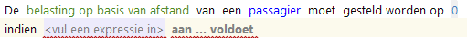

Dit is de meest generieke manier om een voorwaardendeel te construeren.

### Er aan ... voorwaarden wordt voldaan   
Optie voor het opstellen van een samengestelde conditie die betrekking heeft op verschillende attributen/rollen/kenmerken/expressies.

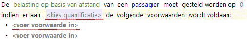

### Attribuut aan voorwaarden voldoet   
Aan de waarde van 1 attribuut worden 1 of meer voorwaarden gesteld.

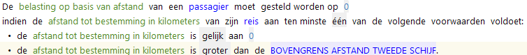

### Rol in onderwerp van regel aan voorwaarde voldoet   
Aan een rol worden 1 of meer voorwaarden gesteld. Dit kunnen voorwaarden met betrekking tot zowel attributen als kenmerken zijn.

Voorbeeld met voorwaarden aan rol 'passagier' in onderwerp van een regel:  
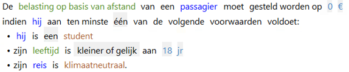

Voorbeeld met voorwaarden aan rol 'reis' in onderwerp van een regel:  
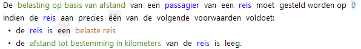

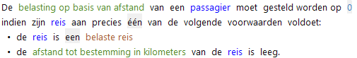

Let op: Omdat het objectttype natuurlijk persoon [**bezield**](../gegevens/objecttype.md) is zijn de rollen passagier en reis verkort aangeduid met 'hij' en 'zijn'.

### Rol aan voorwaarde voldoet   
Optie om voorwaarden te stellen aan andere rollen dan die uit het onderwerp. Aan een rol worden ��n of meer voorwaarden gesteld. Dit kunnen voorwaarden met betrekking tot zowel attributen als kenmerken zijn.

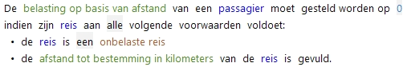

### Aggregaties 
Diverse mogelijkheden om een voorwaarde te stellen aan een verzameling voorkomens van een objecttype die middels een rol te berieken zijn.

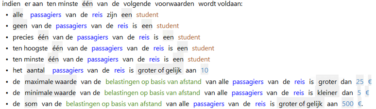

### Regel gevuurd  
Voorwaarde dat de opgegeven versie van een regel tot een toekenning heeft geleid.

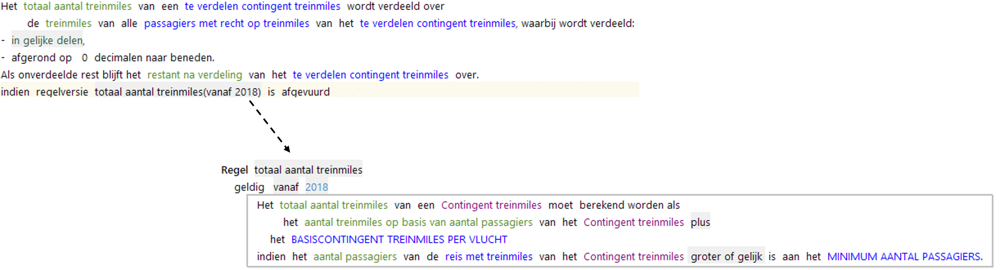

### Regel inconsistent  
Voorwaarde dat de opgegeven versie van een regel een inconsistentie heeft vastgesteld.

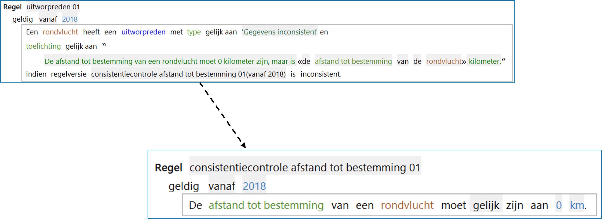

**Let op:** Het onderwerp van beide regels moet gelijk zijn.

### Concatenatie (en/of)
Samenvoegen meerdere "literals" in één voorwaarde.

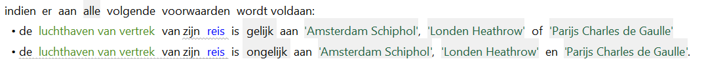
