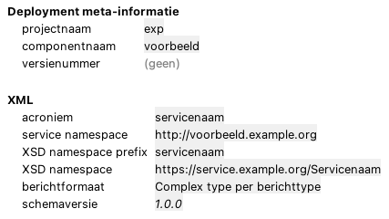
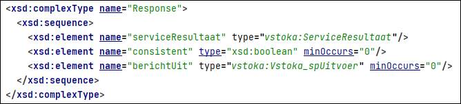
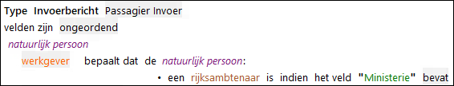

# Service

Een service maakt het mogelijk dat een persoon of systeem zonder ALEF de regels in het project kan uitvoeren.

ALEF services ondersteunen twee data communicatie formaten:

* SOAP
* REST



## Deployment meta-informatie

Gegevens die worden gebruikt bij het bouwen van de servce.
**projectnaam** en **componentnaam** worden gebruikt in de naam van de service. 

* **projectnaam**  
Moet bestaan uit drie letters of cijfers (a-z0-9).
* **componentnaam**
Moet bestaan uit twee tot 10 letters of cijfers (a-z0-9).
* **versienummer**
Versienummer van de service.

## XML (SOAP)

Voor de [SOAP](https://nl.wikipedia.org/wiki/SOAP_(protocol)) endpoint van de service. SOAP bestaat uit een WSDL welke beschrijft welke entry points er zijn en een XSD welke beschrijft hoe het bericht er uit moet zien dat aan een entry point kan worden aangeboden.

* **acroniem**  
* **service namespace**  
Namespace van de service die wordt gebruikt in de WSDL. Geef hier een unieke URL op waarmee de service is te indentificeren. Bijvoorbeeld `mijn-service-naam.organisatie.ext`. 
* **XSD prefix**  
In de XSD kan een korte notatie voor een namespace worden gebruikt in XML prefix genoemd. Deze prefix mag bestaan uit de volgende tekens: `A-Z a-z 0-9 -_`. Er mogen geen spaties in de prefix voorkomen.
* **XSD namespace**  
Elk XSD heeft een unieke namespace waarmee deze kan worden geindentificeerd. Deze namespace wordt als URL opgegeven. Bijvoorbeeld `mijn-bericht-specificatie.organisatie.ext`. 
* **berichtformaat**  
ALEF ondersteund twee bericht formaten:
    * Complex type per berichttype
    * Key-value pairs
* **schema versie**

## Bericht formaten

### Complex type per berichttype

Dit is het meest gebruikte formaat voor berichten en bestaat uit types met attributen en waardes. Voorbeeld:

```xml
<persoon>
    <naam>Piet</naam>
</persoon>
```

### Key-value pairs

Berichtformaat waarbij de data via key-value pairs worden doorgegeven:

```xml
<KeyValuePairs>
    <key>naam</key>
    <valueString>Piet</valueString>
</KeyValuePairs>
```
## Specificaties op niveau van het entrypoint

* **Naam**  
Naam van het entrypoint.
* **Regels**  
Bepaalt de scope van de regels die voor het entrypoint worden uitgevoerd. Dit kan een of meedere regelgroepen zijn of een [regelgroepbundel](../besturing/regelgroepbundel.md).
* **Parametersets**  
Alle parametersets opnemen die mogelijk gebruikt moeten worden op basis van opgegeven rekenjaar/rekendatum. Indien niet gevuld, dan parameters meegegeven bij invoer (via intention "Voeg Parameters toe aan Invoer").
* **Consistentievlag**  
Uit (in geval van uitsluitend een rekenservice) of Aan (ook resultaat van consistentiecontroles wordt teruggegeven). In de response in de XSD ziet dat er zo uit:



### Bericht -Invoer
* **Rekenjaar/rekendatum**   
Jaar of datum waarvoor de service uitgevoerd moet worden (bepaalt de van toepassing zijnde regels en parameters).
* Berichten opstellen **per objecttype**.  
 * Velden kunnen **geordend** (voorgeschreven volgorde) of **ongeordend** (geen voorgeschreven volgorde) zijn.
* Bij **meervoudige objecten**:
    * Via "complex invoerveld" of  "complex uitvoerveld" onderliggend object koppelen door middel van:
        * voor onderliggend object aangemaakt bericht met mogelijk aantal voorkomens;
        * de rol waarmee het onderliggende object in het feittype gekoppeld is aan het bovenliggende object ("beeldt af op") en
        * specificatie of er een omsluitend element is.
* Verplichte/niet-verplichte velden  
Instellen via intention.
* **Verstekwaarde**  
Deze waarde wordt gebruikt als een veld in de invoer leeg is.
* **Koppeling naamgeving**  
Bij het toevoegen van een attribuut, kenmerk of parameter aan een bericht wordt automatisch de veldnaam voor het bericht automatisch gegenereerd. Wijzigingen van namen van attribuut, kenmerk of parameter leiden ook automatisch tot aanpassing van de veldnaam. Tenzij de veldnaam handmatig is gewijzigd.
* **Identificerend veld**  
In een invoerbericht kan een identificerend veld worden toegevoegd. Dit veld kent geen mapping op een element in het gegevensmodel, maar is uitsluitend bedoeld ter identificatie van een instantie. Door dit veld ook op te nemen in het uitvoerbericht kan in de uitvoer de betreffende instantie worden geïdentificeerd.
* **Invoer van numerieke codes met separatoren**  
In een invoerbericht kan een veld worden opgenomen dat een code bevat die is opgebouwd uit numerieke waarden die gescheiden worden door een speciaal teken. De elementen uit de code kunnen worden gemapt op attributen.
* **Kenmerken in berichten**  
    * Kenmerken in in- of uitvoerberichten worden als boolean in de XSD opgenomen.
    * Als bij een invoerkenmerkveld een verstekwaarde is opgegeven, dan is dit veld optioneel. Als er geen verstekwaarde is opgegeven, dan is het veld verplicht.
    * Uitvoerkenmerkvelden zijn altijd verplicht (best practice is om geen kenmerken in de uitvoer op te nemen, maar boolean-attributen).
* **Afleiding kenmerk uit tekstveld**  
Op basis van de inhoud van een tekstveld in een invoerbericht kan een kenmerk worden toegekend. 



## Datatype en mappings
Met een "MappedDataType" wordt voor enumeratiedomeinen een specifieke mapping toegevoegd zoals die met de afnemer is afgestemd.

Onder "Datatypes" kunnen specifieke externe datatypes met beperkingen (bv. aantal posities) worden gedefinieerd.
De algemene interne datatypes worden deels default gemapped op een extern datatype in de XSD:

* Tekst -> string
* Boolean -> boolean
* Datum in dagen -> date
* Datum in millisecondes -> dateTime

Eigen mapping voor de overige algemene interne datatypes (numeriek, percentage) en de project-specifieke domeinen onder "Mappings op het gegevensmodel".
