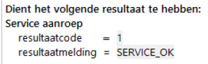

# Testen van services

Voor het testen van een service moet een **Servicetestset** worden aangemaakt. Die kent een andere specificatie dan de [Testset](../testen/Testset.md).

Dit is een interne test binnen ALEF waarmee de specificatie van de service getest wordt in relatie tot het regelmodel.

Na het genereren en deployen van de service wordt de "echte" service in de delivery pipeline en eventueel met behulp van SoapUI getest.

Ten slotte wordt de service uiteraard ook extern getest, technisch en functioneel, in combinatie met een consumer (afnemende applicatie) die de service gebruikt.

## Servicetestset

Een servicetestset bevat testgevallen waarin berichten conform service-specificatie worden opgesteld.

Doel: testen of service functioneel correct gespecificeerd is:
* Berichten
* Mapping

Als sprake is van een technische fout, dan wordt een SOAP-fault-bericht teruggegeven.

Het analyseren en debuggen werkt op dezelfde manier als in andere testsets.

**Let op: De volgorde van elementen in berichten is deels verplicht (zie XSD in de [servicedefinitie](../services/service.md)).**

### Notatie van gegevens

* Decimalen met een punt weergeven
* True/false in plaats van waar/onwaar
* Datumnotatie: yyyy-mm-dd
* Tekstvelden (string) zonder aanhalingstekens

### Serviceresultaat
Het vullen van het resultaat van de service-aanroep is niet nodig voor testen binnen ALEF, maar wel voor een correct resultaat bij het uitvoeren van de servicetesten tijdens de build:

* Resultaatcode = 1
* Resultaatmelding = SERVICE_OK  

