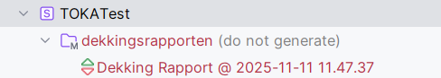
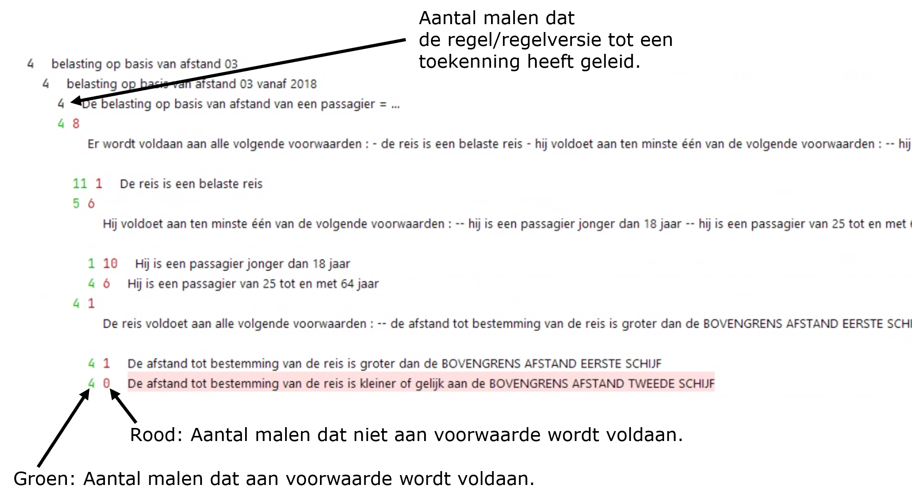

# Testdekking

Testdekking is de verhouding tussen datgene wat getest kan worden en datgene wat met de testsets gedekt wordt. Het testdekkingsrapport geeft inzicht in de mate waarin de testen in de testsets alle paden in de regels raken. Het is een hulpmiddel om testsets te analyseren en aan te vullen.

Het testdekkingsrapport verschijnt als een nieuw model in het Project venster:

Het rapport zelf moet als volgt worden gelezen:

N.B. Binnen een testgeval kan een regel meerdere malen worden uitgevoerd als sprake is van een model met meervoudige objecten.
