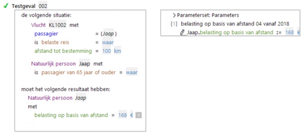
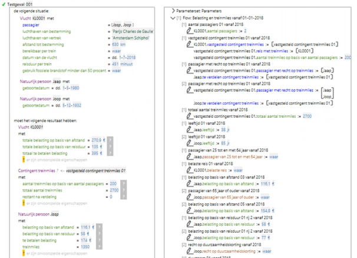
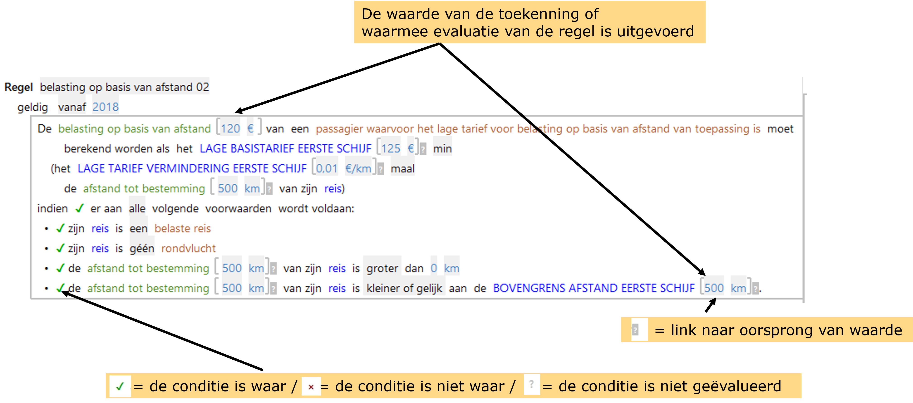

# Testen

Belangrijk onderdeel van de visie op voortbrenging van BRM-services is het voortdurend testen van
(tussen)producten tijdens de voortbrenging. 

De "Best practice Testen" beschrijft hoe projecten het testen kunnen inrichten. 

## Testobject / testscope

ALEF biedt uitgebreide functionaliteit voor het testen van de **testobjecten**: Attributen, regels en regelgroepen, flows en services. 

**Testgevallen** worden gespecificeerd in een **[Testset](../testen/Testset.md)**.

## Analyse en debuggen

Nadat een test is uitgevoerd, wordt een lijst getoond met regels die tot een toekenning hebben geleid.

Door te klikken op het **vraagteken achter een resultaat**, kan worden gesprongen naar de uitgevoerde regel voor verdere analyse. 

Een andere ingang naar analyse is de **executielijst** rechts naast het testgeval. Deze lijst laat alle uitgevoerde regels in de testscope zien en hun waardetoekenningen. Door middel van Ctrl-klik op de regel, kan worden gesprongen naar de uitgevoerde regel voor verdere analyse. 

ALEF toont nu in de regels de toegekende waarde en de invoerwaarden plus een aantal symbolen voor de status van de voorwaarden in de regel.

## Testdekking

Testdekking is de verhouding tussen datgene wat getest kan worden en datgene wat met de testsets gedekt wordt. Het [testdekkingsrapport](../testen/Testdekking.md) geeft inzicht in de de testdekking.

