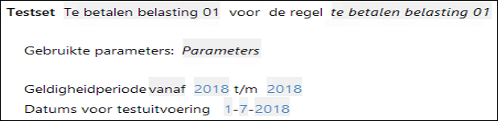
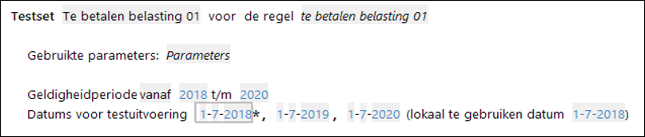
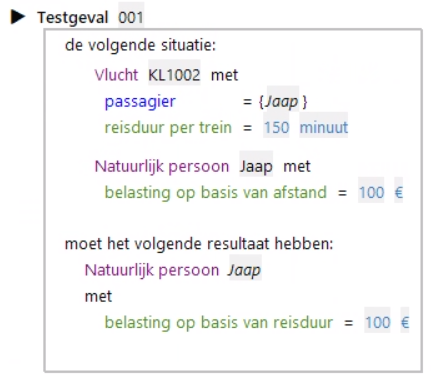
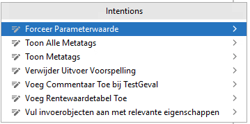
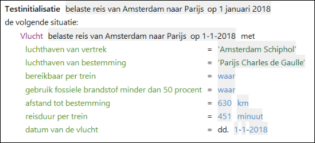
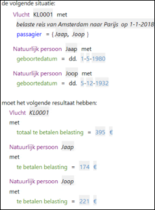
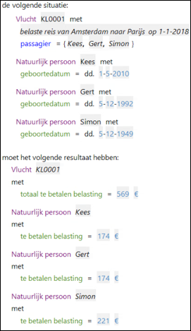

# Testset

In een Testset wordt de scope van de test vastgelegd. De scope geeft aan welke regels betrokken worden in de test. Een testset bevat één of meer **testgevallen**.

Er is specifieke informatie over het [testen van Flows](../testen/TestenFlows.md) en Services. 

## Configuratie testset

De **scope van de test** wordt in de kopregel vastgelegd. In dit voorbeeld us de testscope de regel 'te betalen belasting 01'

Welke **parameterset** wordt gebruikt voor de test, wordt afgeleid van de geldigheidsperiode van de testset en de geldigheid van de parametersets.

Een Testset heeft een **geldigheidsperiode** die aansluit op de geldigheid van regels en parameters in scope van de test. Per jaar moet 1 testdatum worden opgenomen.

Hierboven is een geldigheidsperiode voor de testset van meerdere jaren gebruikt. Voor welk jaar/welke datum de test in ALEF wordt uitgevoerd, wordt vermeld als "lokaal te gebruiken datum" (aangegeven met een sterretje). Tijdens het geautomatiseerd testen in de delivery pipeline worden ook de tests voor de andere datums uitgevoerd.

Tip: Het is beter een aparte testset te maken met een andere geldigheidsperiode en testdatum, omdat je daarin een andere voorspelling van de uitkomsten kunt doen. Van twee tests in dezelfde geldigheidsperiode met dezelfde uitkomst is er immers één overbodig. 

## Testgeval

Een testgeval bevat **testinvoer** en een **testvoorspelling**.

In het voorbeeld hierboven staat de tetsinvoer onder de tekst 'de volgende situatie:' en de testuitvoer onder de tekst 'moet het volgende resultaat hebben:'

In een testgeval waarin attributen van verschillende objecttypes worden gebruikt, moeten voorkomens/instanties van beide objecttypes in de in- en/of uitvoer worden opgenomen.  
Daarbij moet door middel van een rol de relatie met het andere object worden opgenomen. In het voorbeeld hierboven verwijst de rolnaam 'passagier' in blauw naar de instantie 'Jaap' van objecttype 'Natuurlijk persoon'. 

### Gebruik van parameters in een testgeval

Standaard worden de parameters uit de parametersets gebruikt, die genoemd zijn bovenin de testset onder 'Gebruikte parameters'. Wanneer een parametertoekenning buiten de testscope ligt, moet de testset onafhankelijk zijn van periodieke wijzigingen van parameters. Daarvoor kunnen parameterwaarden worden opgenomen in het individuele testgeval met de intention "Forceer Parameterwaarde".

.

In het testgeval verschijnt een lijst van parameterwaarden die invoer zijn voor dit specifieke testgeval:

.

### Testinitialisatie

Wanneer steeds dezelfde invoer wordt gebruikt in testgevallen, kan een set met attribuutwaarden (per objecttype) worden hergebruikt. 

Hieronder wordt een instantie van Vlucht met testinitialisatie geconfigureerd voor hergebruik.

De waarden voor deze instantie van Vlucht kunnen worden opgenomen in meerdere testgevallen door te verwijzen naar de testinitialisatie. 

